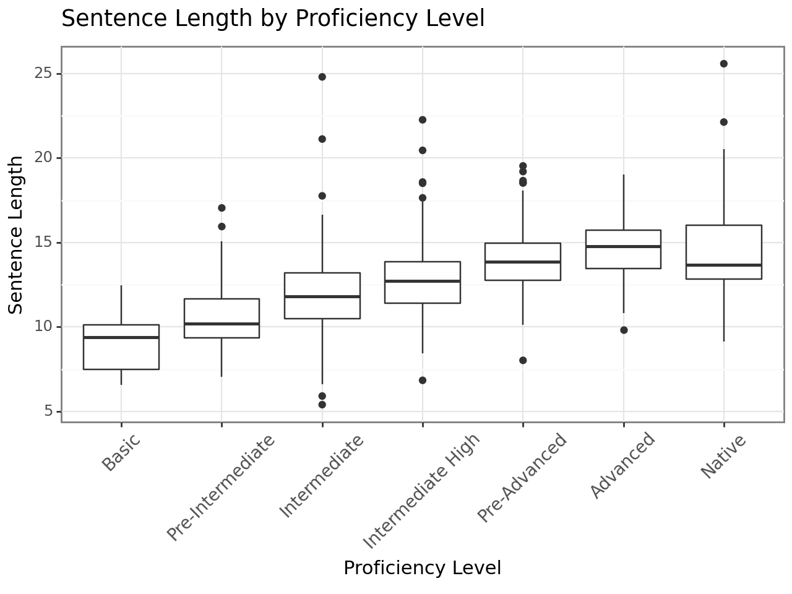

# Cross-Sectional Analysis of Writing Complexity Measures on a Japanese Learner Corpus
### Final project for Summer 2023 Language Development HauptSeminar

## Abstract

This study explores different measures of writing complexity on a Japanese learner corpus. An analysis of writing samples from 687 Japanese learners and a native control group from the I-JAS corpus was conducted via automatically calculated measures. Findings align with those of other widely studied languages, where learners showed a consistent increase of sentence length, clause length, clauses per sentence, and control type token ratio. Consistent with previous studies a negative correlation between coordination and subordination was also observed. 

Figure 1: The average sentence length observed across proficiency
levels

Figure 2: The average clause length observed across proficiency
levels

Figure 3: The average count of clauses per sentence observed
across proficiency levels

Figure 4: The average count of coordinating conjunctions
(CC) observed across proficiency levels

Figure 5: The average count of subordinating conjunctions
(SC) observed across proficiency levels

Figure 6: The average corrected type token ration
(CTTR) observed accross proficiency levels

# References

Theodora Alexopoulou, Marije Michel, Akira Murakami,
and Detmar Meurers. 2017. Task effects
on linguistic complexity and accuracy: A largescale
learner corpus analysis employing natural language
processing techniques. Language Learning,
67(S1):180–208.

Kathleen Bardovi-Harlig. 1992. A second look at tunit
analysis: Reconsidering the sentence. TESOL
Quarterly, 26(2):390–395.

R. Ellis. 2003. Task-based Language Learning and
Teaching. Oxford Applied Linguistics. OUP Oxford.
Matthew Honnibal and Ines Montani. 2017. spaCy 2:
Natural language understanding with Bloom embeddings,
convolutional neural networks and incremental
parsing. To appear.

Masayuki Asahara Hiroshi Matsuda, Mai Omura. 2019.
短単位品詞の用法曖昧性解決と依存関係ラベ
リングの同時学習. The Association for Natural
Language Processing.[言語処理学会 第25回年次
大会]

S. Imai, S. Ito, Y. Nakamura, K. Kikuchi, Y. Akagi,
H. Nakasono, A. Honda, and T. Hiramura. 2009.
Features of J-CAT (Japanese Computerized Adaptive
Test). D. J. Weiss (Ed.), Proceedings of the 2009
GMAC Conference on Computerized Adaptive Testing.
PDF File, 655KB.

Noriko Iwashita. 2006. Syntactic complexity measures
and their relation to oral proficiency in japanese as a
foreign language. Language Assessment Quarterly,
3(2):151–169.

Xiaofei Lu. 2010. Automatic analysis of syntactic complexity
in second language writing. International
Journal of Corpus Linguistics, 15(4):474–496.
Xiaofei Lu. 2011. A corpus-based evaluation of syntactic
complexity measures as indices of college-level
esl writers’ language development. TESOL Quarterly,
45(1):36–62.

John M. Norris and Lourdes Ortega. 2009. Towards an
Organic Approach to Investigating CAF in Instructed
SLA: The Case of Complexity. Applied Linguistics,
30(4):555–578.

Lourdes Ortega. 2003. Syntactic Complexity Measures
and their Relationship to L2 Proficiency: A Research
Synthesis of College-level L2 Writing. Applied Linguistics,
24(4):492–518.

Kumiko Sakoda. 2020. I-jas tanjo no keii. [the background
of compilation of i-jas]. K. Sakoda, S.

Ishikawa, J. Lee (Eds.), Nihongo gakushusha kopasu
I-JAS nyumon: Kenkyu kyoiku ni do tsukauka [Introduction
to the I-JAS: Application for research and
teaching], pages 2–13.

Peter Skehan. 1989. Individual differences in second
language learning. London: Edward Arnold.

Nina Vyatkina. 2012. The development of second language
writing complexity in groups and individuals:
A longitudinal learner corpus study. The Modern
Language Journal, 96(4):576–598.

K. Wolfe-Quintero, S. Inagaki, and H.Y. Kim. 1998.
Second Language Development in Writing: Measures
of Fluency, Accuracy, & Complexity. National Foreign
Language Center Technical Reports. Second
Language Teaching & Curriculum Center, University
of Hawaii at Manoa.
